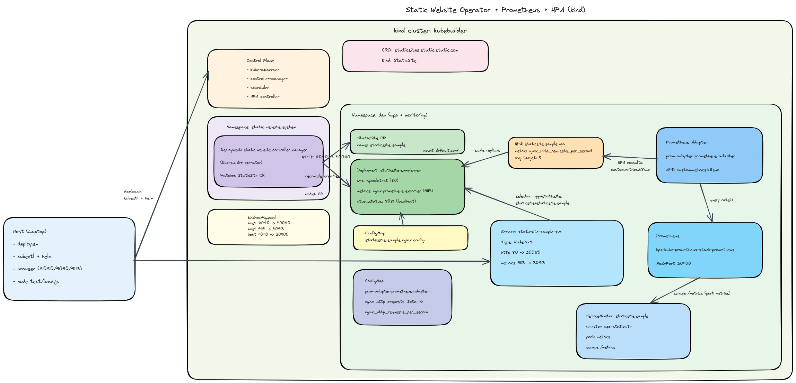

# Static Website Operator + Prometheus + HPA (kind)



Proyecto que demuestra un flujo completo de hosting estático en
Kubernetes con observabilidad y autoscaling real:

- Operador propio (Kubebuilder) que crea Deployment + Service + ConfigMap.
- Nginx sirviendo web y un exporter que publica métricas por pod.
- Prometheus scrapeando el ServiceMonitor.
- HPA escalando en base a requests por segundo.

Todo está organizado por carpetas para poder repetir la instalación en frío.

## Infraestructura (resumen)

Este repo define una cadena completa dentro de un cluster kind:

- Un CRD `StaticSite` y su operador (Kubebuilder) crean `ConfigMap`, `Deployment` y `Service`.
- El `Deployment` incluye Nginx y un sidecar `nginx-prometheus-exporter` (métricas por pod).
- Un `ServiceMonitor` permite que Prometheus scrapee `/metrics`.
- Prometheus Adapter expone la métrica `nginx_http_requests_per_second` en `custom.metrics.k8s.io`.
- El HPA escala el `Deployment` en base a esa métrica.

## Requisitos

- kubectl
- helm
- make
- kind (si vas a ejecutar en kind)
- docker (para construir la imagen del operador)

## ¿Qué instala el script?

`./deploy.sh` crea todo de una sola vez (pensado para alguien que acaba de clonar el repo):

- Crea el cluster kind si no existe (por defecto `kubebuilder`) usando `kind-config.yaml`.
- Instala CRDs del operador.
- Genera manifiestos (RBAC/CRD) y despliega el operador.
- Construye la imagen del operador, la carga en kind y fuerza `imagePullPolicy=IfNotPresent`.
- Reinicia el controller para usar la imagen local.
- Aplica el CR `StaticSite` de ejemplo.
- Instala Prometheus (kube-prometheus-stack) en el namespace elegido.
- Aplica el ServiceMonitor (`prometheus/pthConfig.yml`).
- Instala Prometheus Adapter apuntando al Prometheus correcto.
- Aplica la config del adapter (`hpa/adapter-config.yml`) y reinicia el adapter.
- Aplica el HPA (`hpa/hpa.yml`).

## Ejecutar en producción (sin port-forward)

```
./deploy.sh
```

Notas:

- El script asume namespace `dev`. Para otro usa `NAMESPACE=otro`.
- El cluster por defecto es `kubebuilder`. Cambia con `KIND_CLUSTER`.
- El script exige `kind` y usa `kind-config.yaml` para exponer NodePorts.
- El cluster se crea con `kind-config.yaml`, que expone:
  - Web en `http://localhost:8080`
  - Métricas en `http://localhost:9113/metrics`
  - Prometheus en `http://localhost:9090`
  - NodePorts fijos: `30080` (web) y `30913` (métricas)
  - NodePort fijo Prometheus: `30900`

Si ya tenías un cluster creado sin `extraPortMappings`, necesitas recrearlo:

```
./destroy.sh
./deploy.sh
```
Notas extra:
- El sample se despliega como `NodePort`. En kind necesitas `extraPortMappings`
  si quieres acceder desde el host sin port-forward.
- Si quieres otra imagen del operador, define `IMG`.

Ejemplo:

```
KIND_CLUSTER=kubebuilder IMG=controller:latest ./deploy.sh
```

## Test de carga (requests)

Para generar tráfico y ver crecer la métrica en Prometheus:

```
node test/load.js
```

Opciones:

```
TARGET_URL=http://localhost:8080 REQ=200 CONC=10 node test/load.js
```

## Borrado completo

Para eliminar todo lo desplegado por el script:

```
./destroy.sh
```

## Estructura del repo

- `static-content-operator/`: operador, CRD y controller.
- `prometheus/`: ServiceMonitor para scrape.
- `hpa/`: Prometheus Adapter + HPA (métricas custom).
- `test/`: script de carga para generar requests.
